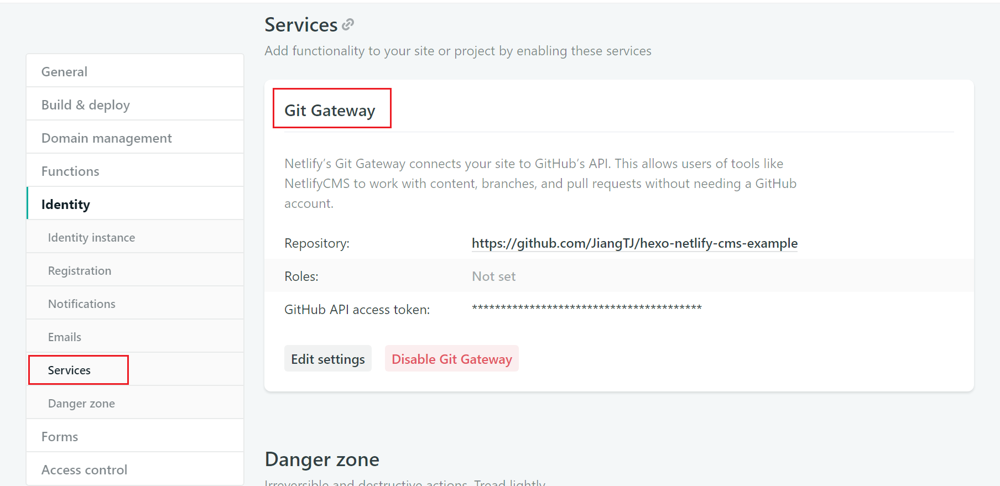
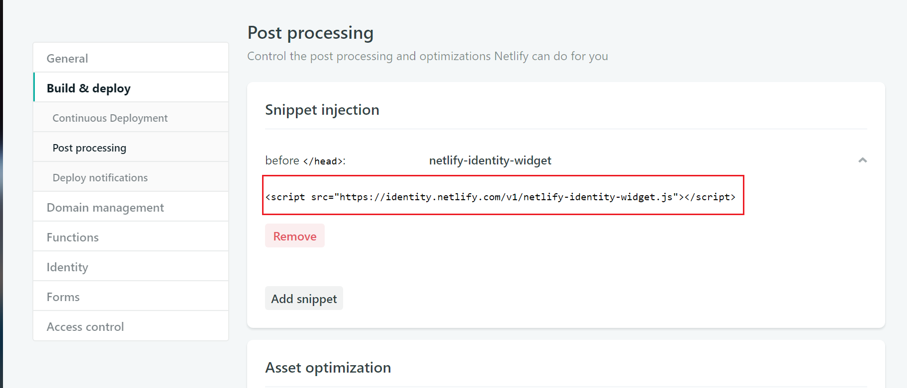

# Hexo Netlify CMS
[](https://www.npmjs.com/package/hexo-netlify-cms)

   

这是一个Netlify CMS的Hexo插件，你可以使用它，简单的开启Netlify CMS服务.   

[Live Demo](https://github.com/JiangTJ/hexo-netlify-cms-example) | [English Docs](README.md)

## 如何使用
### Step1: 添加依赖
```bash
yarn add hexo-netlify-cms
// or npm
npm i hexo-netlify-cms --save
```
### Step2: 在Hexo中添加配置
```yaml
netlify_cms:
  backend:
    name: git-gateway
    branch: master
```
### Step3: 在Netlify中开启服务

开启netlify git-gateway服务
  

添加netlify-identity-widget.js, 代码如下   
`<script src="https://identity.netlify.com/v1/netlify-identity-widget.js"></script>`  


**注意： 建议将身份认证设为仅邀请模式**

Okay, 现在Netlify CMS已经好了, 你可以访问`your-site/admin`查看


## 其他配置
自定义pages自动生成配置
```yml
netlify_cms:
  # pages auto generate
  pages: 
    enabled: true
    # over page collection config
    # if fields not set, would use posts fields config
    config:
      label: "Page"
      delete: false
      editor:
        preview: true
      # fields: 
```

自定义配置文件，覆盖[默认的](admin/config.yml)
```yml
netlify_cms:
  config_file: netlify.yaml
```

开启/关闭覆盖时间格式配置(默认true)
```yml
netlify_cms:
  over_format: true
```

添加脚本, 用于自定义组件和预览样式   
例如：    
添加[youtube.js](https://github.com/JiangTJ/hexo-netlify-cms-example/blob/master/source/js/cms/youtube.js)至你的博客下  
或者添加[img.js](https://github.com/JiangTJ/hexo-netlify-cms-example/blob/master/source/js/cms/img.js)至你的博客下   
```yml
# 需要跳过渲染
skip_render:
  - js/**
netlify_cms:
  scripts:
    - js/cms/youtube.js
    #- js/cms/img.js
    #或者使用 jsdelivr cdn
    #- https://cdn.jsdelivr.net/gh/JiangTJ/hexo-netlify-cms-example@0.0.1/source/js/cms/youtube.js
    #- https://cdn.jsdelivr.net/gh/JiangTJ/hexo-netlify-cms-example@0.0.1/source/js/cms/img.js
```

另外，其他的`netlify_cms`配置变量可以在[Netlify CMS](https://www.netlifycms.org/docs/configuration-options/)中找到  

## 提示
1. 建议开启`Netlify Large Media`，可以使媒体载入更快。[Large Media Docs](https://www.netlify.com/docs/large-media/)

## 调试
Step 1: 执行下面的命令：
```
yarn link
git clone --recursive https://github.com/JiangTJ/hexo-netlify-cms-example.git example
cd example
yarn link hexo-netlify-cms
yarn install
```

Step 2: 修改例子中 `backend.name` 为 `test-repo`

Step 3: 运行 `hexo s`
